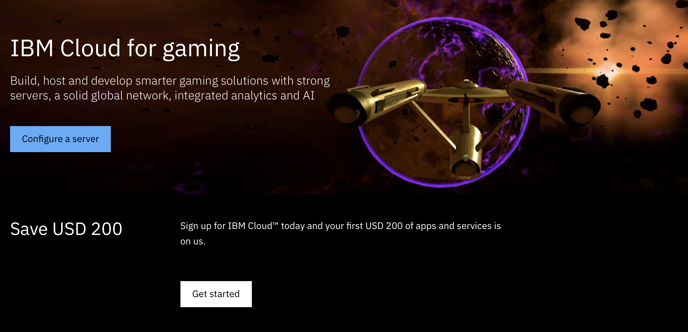
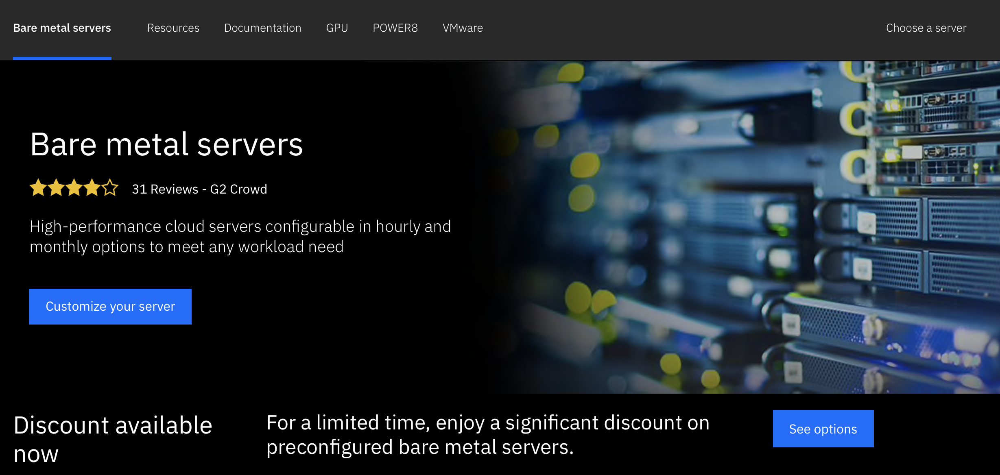
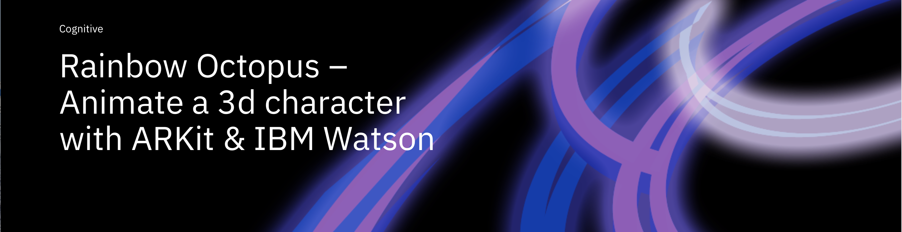
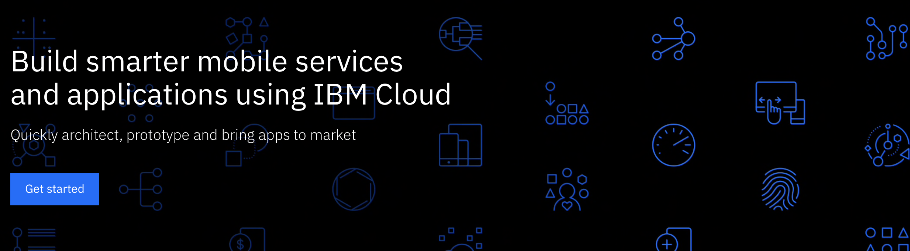
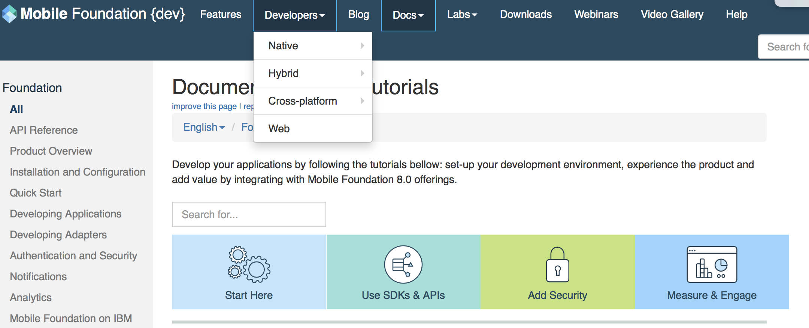

# 2019 IBM gaming

# URL: [https://bit.ly/2U79LBt](https://bit.ly/2U79LBt)

[IBM Cloud for Gaming](https://www.ibm.com/cloud/gaming)

## Single tenant
* A bare metal server dedicated to customers for complete control, flexibility, and security.

## Computing power
* From single processor 4-core architectures to quad-processor 12-core architectures and up to 3 TB RAM.
* Local storage range: Up to 36 drives per server. 800 GB to 1.2 TB SSDs.

## Local Storage Rangee
* Up to 36 drives per server. 800 GB to 1.2 TB SSDs.

[Bare Metal Servers Resources](https://www.ibm.com/cloud/bare-metal-servers/resources)

[Unity Game Engine](https://unity.com)

## Unity and Watson

* [Get started with the IBM Watson Unity SDK](https://developer.ibm.com/tutorials/use-ibm-watson-sdk-with-unity/)
* [Watson Developer Cloud Unity SDK](https://github.com/watson-developer-cloud/unity-sdk)
* [Watson SDK for Unity](https://github.com/watson-developer-cloud/unity-sdk)
* [Custom Language Model in Unity](https://developer.ibm.com/tutorials/watson-speech-to-text-custom-language-model/)
* [VR Speech Sandbox Tutorial](https://developer.ibm.com/tutorials/use-ibm-watson-sdk-with-unity/ 

* [Star Trek: Bridge Crew - IBM Watson Trailer](https://youtu.be/6hDkkELJTZU)

* https://developer.ibm.com/patterns/build-an-ai-powered-ar-character-in-unity-with-arkit/
* [Build an AR avatar for the iPhone. Use Watson services deployed to an iPhone with ARKit to have a voice-powered animated avatar in Unity](https://developer.ibm.com/patterns/build-an-ai-powered-ar-character-in-unity-with-arkit/)
* [ARKit in Unity Pattern](https://developer.ibm.com/patterns/build-an-ai-powered-ar-character-in-unity-with-arkit/)
* [Rainbow Octopus. Animate a 3d character with ARKit & IBM Watson](https://www.ibm.com/blogs/emerging-technology/rainbow-octopus/) 
* [In June 2017 Apple released the ARKit API tool for developers working on virtual reality and augmented reality applications.](https://developer.apple.com/arkit/)
* [ARKit in Unity Pattern](https://developer.ibm.com/patterns/build-an-ai-powered-ar-character-in-unity-with-arkit/)
* [Build an AR avatar for the iPhone. Use Watson services deployed to an iPhone with ARKit to have a voice-powered animated avatar in Unity](https://developer.ibm.com/patterns/build-an-ai-powered-ar-character-in-unity-with-arkit/)
* [Use Watson Assistant, Watson Speech to Text, and Watson text-to-speech deployed to an iPhone with ARKit to have a voice-powered animated avatar in Unity](https://developer.ibm.com/tutorials/watson-speech-to-text-custom-language-model/)

[IBM Modile Foundation](https://console.bluemix.net/catalog/services/mobile-foundation)

* [Mobile Code Patterns](https://developer.ibm.com/patterns/category/mobile/)
* [Build an AR avatar for the iPhone](https://developer.ibm.com/patterns/build-an-ai-powered-ar-character-in-unity-with-arkit/)
* [IBM Mobile Foundation](https://console.bluemix.net/catalog/services/mobile-foundation)
