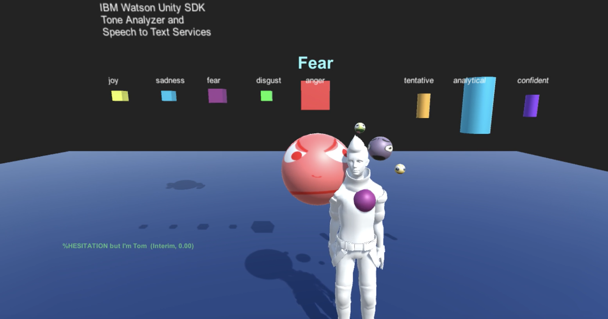

# 2019 IBM gaming

# URL: [https://bit.ly/2U79LBt](https://bit.ly/2U79LBt)

[IBM Cloud for Gaming](https://www.ibm.com/cloud/gaming)

[Bare Metal Servers Resources](https://www.ibm.com/cloud/bare-metal-servers/resources)

[Unity Game Engine](https://unity.com)

# [Watson Unity SDK](https://github.com/watson-developer-cloud/unity-sdk)

## Watson Unity SDK services

 
[IBM Watson + Unity Hello Virtual World 4 EMOTIONAL AVATAR](https://www.youtube.com/watch?v=fOfFrGsNwHo)

* [Taj 1: Watson Unity SDK intro](https://youtu.be/sNPsdUWSi34)

* [Watson Assistant(Chatbot) ](https://www.ibm.com/cloud/watson-assistant/)

* [Watson Compare Comply V1](https://www.ibm.com/cloud/compare-and-comply) "Extract data from contracts and governing documents to increase productivity, reduce costs and minimize exposure"

* [Discovery](https://www.ibm.com/watson/services/discovery/) "Unlock hidden value in data to find answers, monitor trends, and surface patterns with the world’s most advanced cloud-native insight engine"

* [Language Translator V3](https://www.ibm.com/watson/services/language-translator/)

* [Natural Language Classifier](https://www.ibm.com/watson/services/natural-language-classifier/) help you understand its concepts, entities, keywords, sentiment, and more.

* [Natural Language Understanding](https://www.ibm.com/watson/services/natural-language-understanding/) Analyze text to extract metadata from content such as concepts, entities, keywords, categories, sentiment, emotion, relations, and semantic roles using natural language understanding.

* [Personality Insights](https://www.ibm.com/watson/services/personality-insights/)

* [Speech to Text](https://www.ibm.com/watson/services/speech-to-text/)
* [Text to Speech](https://www.ibm.com/watson/services/text-to-speech/)
* [Tone Analyzer](https://www.ibm.com/watson/services/tone-analyzer/)

* [Visual Recognition](https://www.ibm.com/watson/services/visual-recognition/)

 

 

## Unity and Watson examples

* [Hands On Watson SDK for Unity Workshop](https://github.com/akeller/GDC-workshop)
* [IBM & Unity partner to bring the power of AI to developers with IBM Watson SDK for Unity](https://blogs.unity3d.com/2018/02/20/bringing-the-power-of-ai-to-developers-with-the-ibm-watson-unity-sdk/)

* [Install the IBM Watson SDK for Unity: Video](https://www.youtube.com/watch?v=rhDjNNzh-Nw)
* [Watson Unity SDK: creating Watson Services: Video](https://www.youtube.com/watch?v=xKzSzTvRH68)
* [Unity + IBM Watson + Hello World: Video ](https://www.youtube.com/watch?v=tkvWi16rlE8)

* [Watson SDK for Unity](https://github.com/watson-developer-cloud/unity-sdk)
* [Amara Starter AI Project](https://github.com/akeller/Starter-AR-Project)

* [IBM Watson SDK for Unity Speech and Language Translation Multiple Languages - Part 1](https://www.youtube.com/watch?v=Xluwq9LuSTs)
* [IBM Watson SDK for Unity Speech and Language Translation Multiple Languages Part 2](https://www.youtube.com/watch?v=swsJo_jlCNo)

* [Watson Unity SDK: Speech to Text example: Video](https://www.youtube.com/watch?v=woKMumx3TcY)
* [Facial Recognition with Watson Unity SDK: Video](https://www.youtube.com/watch?v=PvgK8wfQ_Mw)
* [Get started with the IBM Watson Unity SDK](https://developer.ibm.com/tutorials/use-ibm-watson-sdk-with-unity/)
* [Watson Developer Cloud Unity SDK](https://github.com/watson-developer-cloud/unity-sdk)
* [Custom Language Model in Unity](https://developer.ibm.com/tutorials/watson-speech-to-text-custom-language-model/)
* [VR Speech Sandbox Tutorial](https://developer.ibm.com/tutorials/use-ibm-watson-sdk-with-unity/) 

* [IBM Unity SDK: Video](https://www.youtube.com/watch?v=_ARXT--81GY)
* [Star Trek: Bridge Crew - IBM Watson Trailer](https://youtu.be/6hDkkELJTZU)

* [Rainbow Octopus - Test - Unity + ARKit + Watson SDK video:](https://www.youtube.com/watch?v=OPek4INjb6A&feature=youtu.be)
* [Rainbow Octopus Source on Github](https://github.com/ibmets/rainbow-octopus)

* [Use Watson services deployed to an iPhone with ARKit to have a voice-powered animated avatar in Unity](https://developer.ibm.com/patterns/build-an-ai-powered-ar-character-in-unity-with-arkit/)
* [ARKit in Unity Pattern](https://developer.ibm.com/patterns/build-an-ai-powered-ar-character-in-unity-with-arkit/)
* [Rainbow Octopus. Animate a 3d character with ARKit & IBM Watson](https://www.ibm.com/blogs/emerging-technology/rainbow-octopus/) 
* [In June 2017 Apple released the ARKit API tool for developers working on virtual reality and augmented reality applications.](https://developer.apple.com/arkit/)
* [Build an AR avatar for the iPhone. Use Watson services deployed to an iPhone with ARKit to have a voice-powered animated avatar in Unity](https://developer.ibm.com/patterns/build-an-ai-powered-ar-character-in-unity-with-arkit/)
* [Use Watson Assistant, Watson Speech to Text, and Watson text-to-speech deployed to an iPhone with ARKit to have a voice-powered animated avatar in Unity](https://developer.ibm.com/tutorials/watson-speech-to-text-custom-language-model/)

[IBM Modile Foundation](https://console.bluemix.net/catalog/services/mobile-foundation)

* [Mobile Code Patterns](https://developer.ibm.com/patterns/category/mobile/)
* [Build an AR avatar for the iPhone](https://developer.ibm.com/patterns/build-an-ai-powered-ar-character-in-unity-with-arkit/)
* [IBM Mobile Foundation](https://console.bluemix.net/catalog/services/mobile-foundation)
